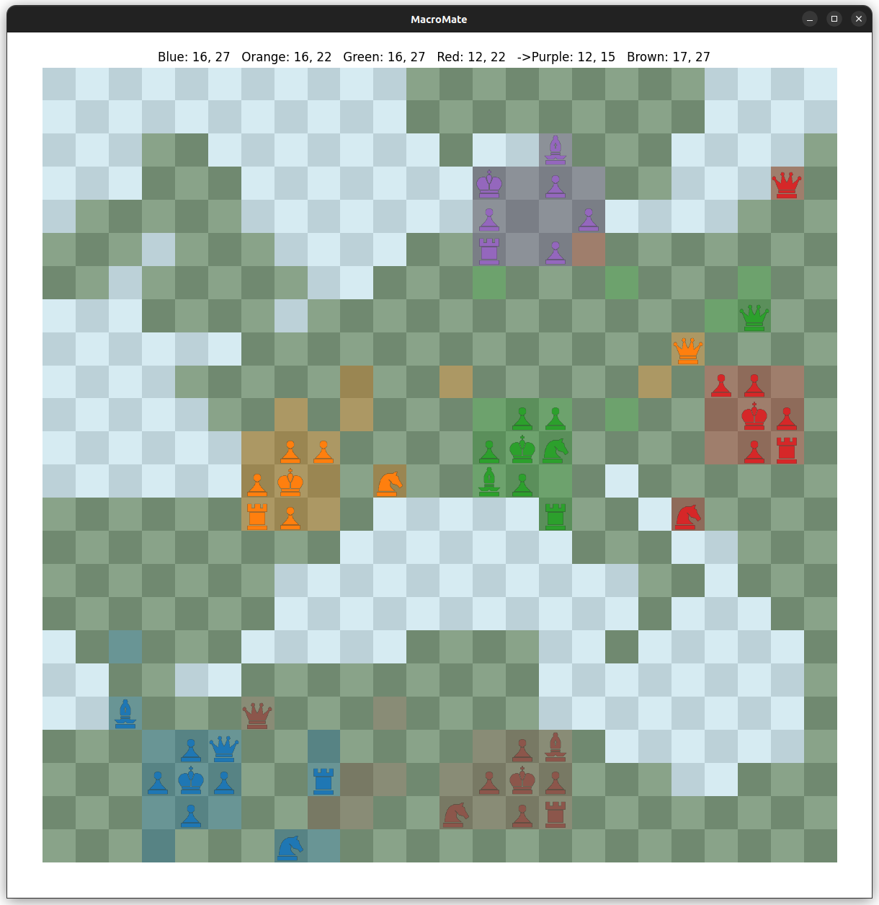
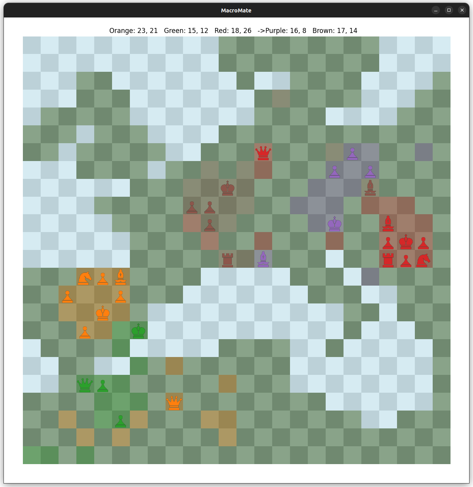
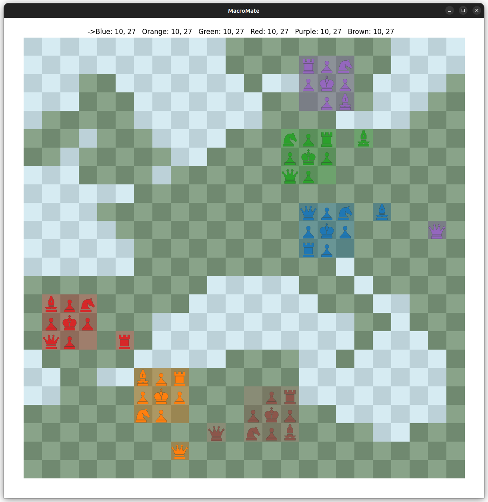

# MacroMate


Multiplayer chess on a map!

This repo contains a proof of concept for a single player version of the game.
And some bads bots as opponents.

## Try It

### Play the Game

Dependencies: matplotlib

```shell
git clone https://github.com/oOo0oOo/macromate.git
cd macromate

# E.g. Create venv, install requirements (only matplotlib)
# pip install -r requirements.txt 

python engine/game.py
```

1. You are blue and you move first.
2. Click on one of your pieces, then click a target position.
3. Wait for all the bots to move.
4. Have fun!

### Create custom Map 

OPTIONAL

Dependencies: matplotlib, geopandas, cartopy

```shell
# Requires a separate venv: map/requirements.txt
cd map
python create_map.py
```

## Game Rules

A first ruleset, all of this is flexible

### Board Setup

32x32, 1 player, 5 bots runs quick enough. 
Increase at your own risk.

1. Water tiles on the board are not accessible
2. Players spawn randomly on the map
3. Corner pieces are randomly placed for each player
4. Human player is always blue and always starts

### Piece Movement

Pieces can move as expected from chess EXCEPT
- Maximum move length is 8
- Pawns can move straight in all directions
- Pawns can capture diagonally in all directions

### Game Turn

- Players take turns making a single move
- New territory is captured: No effect for now
- Mate eliminates player

### Future Extensions

Implemented but not used (gain some speed):
- Territory is captured in an area from new position to king
- Evaluate board based on territory

MacroMate was initially designed as "Strategy Chess".
A complete version could also include:

- Controlled territory gives "points"
- Use points to spawn in new pieces around your king
- And/Or spawn in the remaining 8 pieces one by one every round

## Bots

Finding a good move in MacroMate is challenging because
there are so many possible moves and game states.

Further, this project is just a small PoC built in Python with inefficient code.

Some heavy simplification were necessary:

- All other players are viewed as a SINGLE enemy, which can only take one turn
- Only pieces within 8 steps from the current bounding box are considered
- Boards are evaluated based on piece values; player vs all_others
- Tree search w alpha-beta pruning, only depth 3; It's already kinda slow 🫤

Overall its quite easy to beat the bots!

## Screenshots






## License

This project is licensed under the terms of the MIT license.